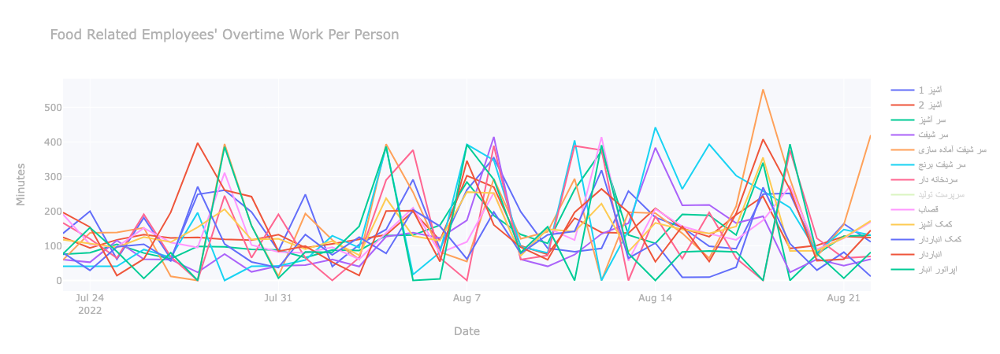
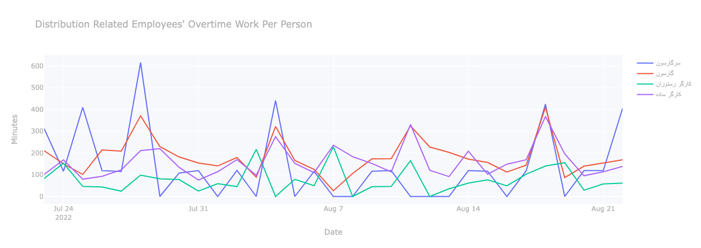
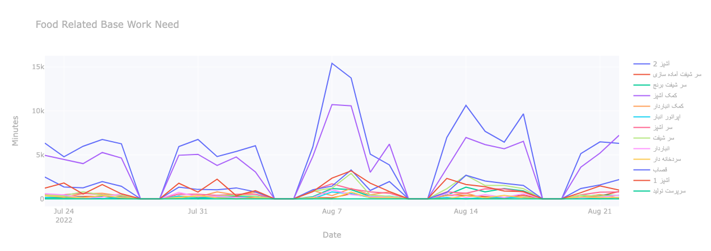
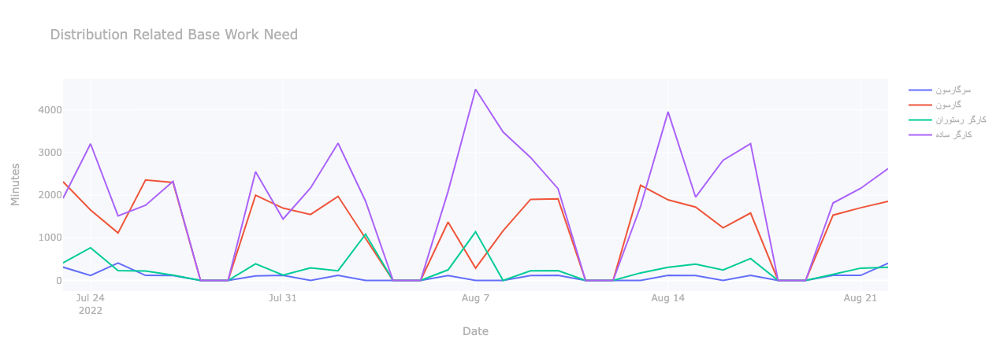
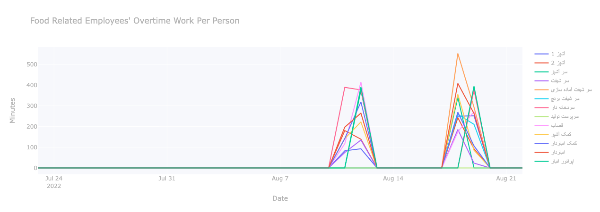
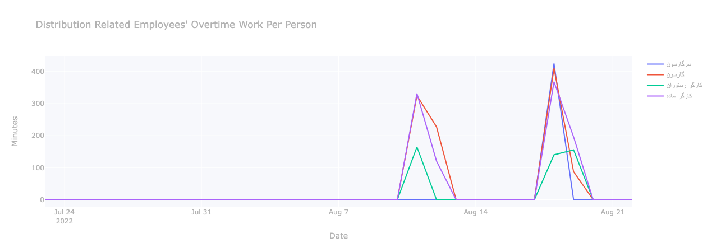
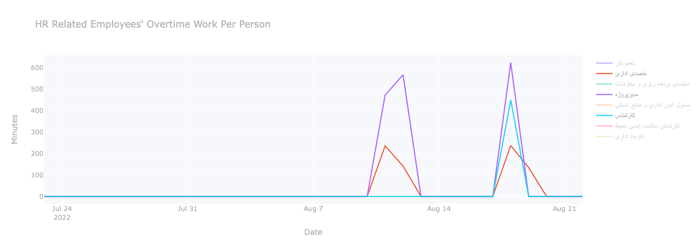

# Employment Optimization Problem

> *This is a project for the course Linear Optimization (1218183) at Amirkabir University of Technology.*

## Future Work and Improvements
I plan to improve the project in the following ways:
- **Create more modular parts for the data manipulation part:** Use the same code with more diverse datasets.
- **Modularize the Optimization model:** Use the model for similar employment problems with a different context.
- **Fully migrate the problem to English:** Allow the code to be universally used and understood.
- **Add support for more types of food:** EX: Prepared food, bought food, etc.


## The Problem
A catering company has a number of employees with specific job titles *(EX: `Chef_1`, `Chef_2`, `Butcher`, ...)* These employees follow below conditions:

1. Each employee must work 8 hours per weekday. _(Everyday except Thursdays & Fridays)_
1. Each employee can work overtime on any day of the week.
1. The company pays employees a monthly base wage.
1. Overtime wage is 1.4 times the base wage.

Current overtime work hours for each employee is given in a table like below:

|Date\Employee| emp_1 | emp_2 | ... | emp_n |
|:--------|:-------:|:-------:|:-----:|:-------:|
| date_1 |w_1_1|w_1_2|...|w_1_n|
| date_2 |w_2_1|w_2_2|...|w_2_n|
| ...    |...|...|...|...|
| date_m |w_m_1|w_m_2|...|w_m_n|

Where _`w_i_j`_ is the overtime work hours of employee _`j`_ on date _`i`_.

Looking at the table, it seems that the overtime work hours are too high and it leads to extra costs for the company.  
The directors and the HR department have agreed to recruit new employees to reduce the overtime work hours. However, the following conditions must be met:

- No current employee can be fired.
- New employees will be considered to all the conditions for the current employees.
- A new job title cannot be introduced.
- New employees will be payed the average base wage of the current employees with the same job title.

The company has to supply a number of food potions per day which is given in a table like below:

|Date\Portions| food_1 | food_2 |
|:--------|:-------:|:-------:|
| date_1 |p_1_1|p_1_2|
| date_2 |p_2_1|p_2_2|
| ...    |...|...|
| date_m |p_m_1|p_m_2|

Where _`p_i_j`_ is the number of portions of food type _`j`_ on date _`i`_.

The following conditions are given for the demands:
- The supply must exactly meet the demand. since _no food can be stored_.
- Each month has the same menu which is set at the beginnig of the year.
- Both types of foods must be cooked. _(No food can be bought as of now)_

Eventually, The goal is to minimize the personel costs of the company by optimizing the number of employees and their work hours.

## Model

### Parameters
The following parameters are used in the model:
- **The time period**: $D = \set{\text{2022-07-23},\dots, \text{2022-08-22} }$
- **Employees**: $Emp = \set{\text{Employee numbers}}$
- **Job Groups**: $JG = \set{\text{All Unique Job Groups}}$

### Variables and Data Structures
To model the problem, the following variable structure is used:
- $x_{i,d}$ is the basic work hour of employee $i$ on day $d$.
- $x \prime_{i,d}$ is the overtime work hour of employee $i$ on day $d$.
- $y_{g,d}$ is the required basic work hour of job group $g$ on day $d$.
- $y \prime_{g,d}$ is the required overtime work hour of job group $g$ on day $d$.
- $w_i$ is the base wage of employee $i$.
- $w \prime_i$ is the overtime wage of employee $i$.
- $w_g$ is the average base wage of job group $g$. (This is the new employees' base wage)
- $w \prime_g$ is the average overtime wage of job group $g$. (This is the new employees' overtime wage)
- $p_{d,j}$ is the number of demanded portions of food type $j$ on day $d$.

**There are 3 job categories:**
- **Food Related**: These job groups have direct relationship with cooked food.
- **Distribution Related**: These job groups have direct relationship with the distribution of food. (Both cooked and bought)
- **HR Related**: These job groups have direct relationship with the HR department. (Hiring, Managment, etc.)

> _**Job groups**_ are employees' _**job titles**_. (Ex: `butcher`, `chef`, `waiter`, etc.) However, employees don't have impact on every part of the supply chain; meaning, their work hours are <ins>_not_</ins> affected by changes in the demand. Therefore, job groups are categorized based on their influence on the supply.  

### Objective Function
The objective function is defined as follows:
```math
\min z = \sum_{d\in D} \sum_{i\in Emp} (x_{i,d} \cdot w_i + x \prime_{i,d} \cdot w\prime_i)+ \sum_{d \in D} \sum_{g \in Job\space Groups} (y_{g,d}\cdot w_g + y\prime_{g,d}\cdot w\prime_g)\\
```

> _The reason to have each individual current employee as a desicion variable is that their base wage varies and their work hours are not optimized. Therefore, initially, the model optimizes the current employees' work hours and then uses the remaining demand to hire new employees._

### Constraints
The model has fairly simple constraints as the supply and demand need to be equal and the demand is fixed. The constraints are defined as follows:

```math
\begin{equation}
x_{i,d}=
    \begin{cases}
        480 & d \in D_{weekdays}\\
        0 & d \in D_{weekends}
    \end{cases}
\end{equation}
,\forall i\in Emp, \forall d\in D
``` 
```math
\begin{equation}
y_{g,d} = 0
\end{equation}
,\forall g\in JG, \forall d\in D_{weekends}
```
```math
\begin{equation}
y_{g,d} \geq 0
\end{equation}
,\forall g\in JG, \forall d\in D_{weekdays}
```
```math
\begin{equation}
\sum_{i \in {Emp_{g}}} (x_{i,d} + x\prime_{i,d}) +
y_{g,d}+y\prime_{g,d}
\geq \delta_{g,d}
,\forall d \in D,\ \forall g \in JG
\end{equation}
```


#### Demands
For each job category, a cost $\theta$ is calculated for each day:  
```math
\begin{equation}
\theta_{g,d} = 
    \begin{cases}
        \sum_{i \in Emp_g}(x_{i,d}+x\prime_{i,d}) \over \sum_{j \in Cooked\ Food}p_{d,j}& g \in JG_{Food\space Related}\\\\

        \sum_{i \in Emp_g}(x_{i,d}+x\prime_{i,d}) \over \sum_{j \in Cooked\ Food}p_{d,j} + \sum_{j \in Distributed\ Food}p_{d,j}& g \in JG_{Distribution\space Related}\\\\

        \sum_{i \in Emp_g}(x_{i,d}+x\prime_{i,d}) \over \sum_{i \in Emp}(x_{i,d}+x\prime_{i,d})& g \in JG_{HR\space Related}
    \end{cases}
\end{equation}
```
> The costs show the total amount of time each job group has to work in order to accomplish one unit of the demand. For Example, $\theta_{chef,2022-07-23} = 15$ means that the `chef` job group has to work 15 minutes on `2022-07-23` to cook one portion of food.

The demands are given in the following table:  
|Demand|Description|Formula|
|:-----:|:----------|:------|
|$\delta_{Food,d}$|Food related demand on day $d$|$(\sum_{j \in Cooked\ Food}p_{d,j}) \times \theta_{Food,d}$|
|$\delta_{Distribution,d}$|Distribution related demand on day $d$|$(\sum_{j}p_{d,j}) \times \theta_{Distribution,d}$|
|$\delta_{HR,d}$|HR related demand on day $d$|$(\sum_{i\in Emp} (x_{i,d}+ x \prime_{i,d})+ \sum_{g \in Job\space Groups} (y_{g,d} + y\prime_{g,d}))\times \theta_{HR,d}$ |


> ❗️**Important**: Bear in mind that the $\theta_{g,d}$ values are constants and can not be changed. The summations in $\theta_{g,d}$ shall not be mistaken with the summations in the constraints. It is wrong to cancel them in $\delta_{g,d}$ as the model is not allowed to modify the $\theta_{g,d}$ values.

### Results
Below are the employees' work hours before optimization:





#### after optimization, the work hours are as follows:
##### Base Work Hour Needs:




##### Overtime Work Hour Needs:





